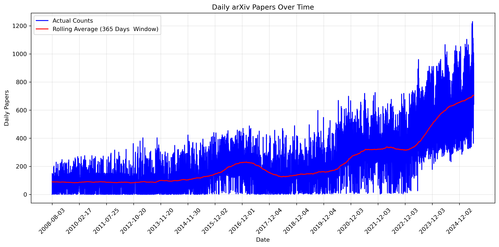
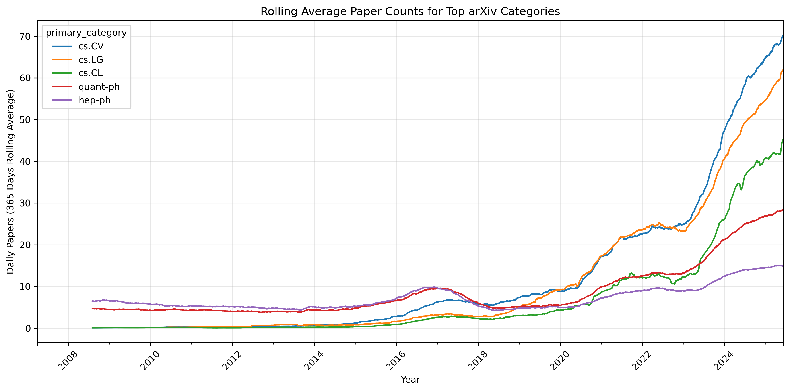
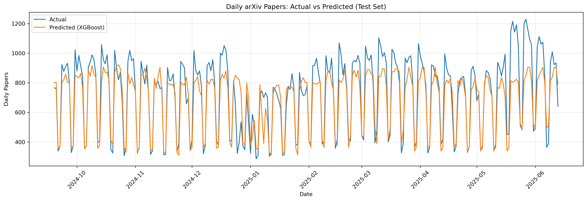

# Analyzing and Forecasting Daily arXiv Publications Using Machine Learning

arXiv is a free, open-access repository for scientific publications spanning fields such as Physics, Mathematics, Computer Science & AI, Statistics, and more. New papers are posted daily (excluding weekends), each identified by a unique ID and assigned subject-area labels (“categories”) that help readers navigate research by field.

In this project, we analyze **1M+ papers published between 2007 and 2025**, using data from the [arXiv Dataset](https://www.kaggle.com/datasets/jimmyyang0928/arxiv-dataset). Our goals are to monitor the number of daily publications, uncover long-term trends in scientific output, and identify the growth of specific research categories.

Forecasting the evolution of scientific productivity is valuable for both research planning and practical decision-making. Understanding which fields dominate over time can inform the **optimal allocation of funding**, reveal emerging areas of interest, and provide a clearer picture of **overall research dynamics**.

From a technical standpoint, forecasting daily publication counts is a **challenging time-series problem**. This project explores the application of **feature-based machine learning (XGBoost)**, with a **classical ARIMA model included as a simple baseline** to contextualize the results.

---

## Tech Stack
- **Python**: NumPy, Pandas, Matplotlib, Scikit-learn, XGBoost, SciPy, statsmodels  
- **Jupyter Notebook**   

---

## Project Overview

The target for forecasting is the **total number of daily publications**. After data cleaning and feature extraction, we obtain a dataset linking the **date** to the **number of publications on that day**. 

The trend over time is illustrated in Figure 1.

  
*Figure 1: Time series of daily arXiv publications. The red line represents the rolling average computed over 365 days.*

Figure 1 shows a substantial growth in daily publications in recent years. To understand this better, we examine the publication patterns of the most popular categories.

  
*Figure 2: Rolling average (365-day window) of the five most popular primary categories.*  
*Blue: Computer Science – Computer Vision (`cs.CV`), Orange: Computer Science – Machine Learning (`cs.LG`), Green: Computer Science – Computation and Language (`cs.CL`), Red: Quantum Physics (`quant-ph`), Purple: High Energy Physics – Phenomenology (`hep-ph`).*  

Figure 2 highlights that AI-related fields (`cs.CV`, `cs.LG`, `cs.CL`) have overtaken physics-related categories (`hep-ph`, `quant-ph`) in daily publication counts since ~2018.

---

## Models Implemented

Two models were implemented to forecast daily publications:

1. **Machine Learning Model: XGBoost**  
   - Builds multiple decision trees sequentially, refining predictions to minimize residual errors.  
   - Feature engineering was applied:
     - *Lagged features*: `lag7`, `lag30`, `lag60`, `lag365`  
     - *Smoothed features*: rolling averages `roll7`, `roll90`, `roll180`  
   - These features enable the model to capture both short-term fluctuations and longer-term trends.

2. **Traditional Model: ARIMA**  
   - Used as a **deliberately simple baseline**.  
   - Models the current value as a linear combination of past observations (`p` lags) and past forecast errors (`q` lags).  
   - Data were transformed (Box-Cox, differencing) to improve stationarity.  
   - **Note:** Although the series exhibits seasonality, we did not implement SARIMA, since the goal was to provide a reference point for evaluating XGBoost.

---

## Results

  
*Figure 3: XGBoost predictions (orange) vs actual daily publications (blue) over approximately one year.*

Predictions were evaluated using a **one-step-ahead validation setup**, meaning each prediction uses only historical **observed values** as input.  

- **XGBoost MAE:** 88.0 papers/day  
- **ARIMA baseline MAE:** 126.8 papers/day  
- **Improvement:** 31%  

These results demonstrate the impact of **feature engineering and nonlinear modeling** in capturing noisy patterns in the data.  
**Caveat:** ARIMA was intentionally kept simple, and results reflect this specific evaluation setup.

---

## Conclusions & Outlook

This project illustrates how **feature-based machine learning models**, such as XGBoost, can be applied to noisy, non-stationary time series. In this dataset and evaluation setup, XGBoost outperformed a classical ARIMA baseline, highlighting the benefits of engineered lag and rolling features for short-term prediction.

**Limitations & next steps:**  
- Results are valid for **one-step-ahead forecasting**; multi-step forecasting would require recursive or direct approaches.  
- Incorporating seasonal models (e.g., SARIMA) or alternative ML approaches (e.g., LSTMs, Prophet) could further improve predictions.  
- Hyperparameter tuning and more robust cross-validation strategies could enhance model reliability.
